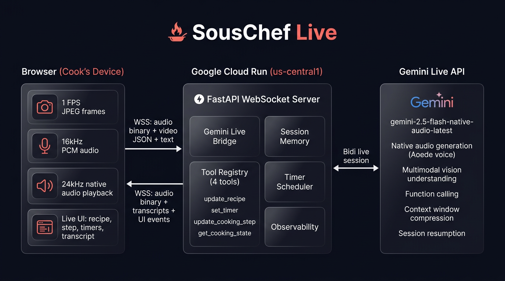

# SousChef Live

**A real-time AI sous-chef that sees, hears, and proactively guides you while you cook.**

Built for the [Gemini Live Agent Challenge](https://geminiliveagentchallenge.devpost.com/) using the Gemini Live API, Google Cloud Run, and the `google-genai` SDK.

---

## What It Does

SousChef Live streams your kitchen camera and microphone to a Gemini Live model that watches, listens, and coaches you in real-time — hands-free. Unlike recipe chatbots, SousChef:

- **Sees** your cooking through continuous video (1 FPS JPEG frames)
- **Hears** both your voice and cooking sounds (16kHz PCM audio)
- **Speaks** naturally with native audio output (24kHz) and a chef persona
- **Interrupts** when it spots danger or mistakes (proactive audio)
- **Sets timers** automatically without being asked
- **Tracks your progress** through a cooking step state machine
- **Handles barge-in** — interrupt the chef mid-sentence and get immediate answers

## Architecture



```
Phone Camera + Mic → Browser Client (Vanilla JS + AudioWorklets)
        ↓
    WebSocket (binary audio + JSON)
        ↓
    FastAPI on Cloud Run
        ↓
    Gemini Live API (gemini-2.5-flash-native-audio-latest)
        ↓
    In-memory SessionStore + Timer Scheduler
```

| Component | Technology |
|-----------|-----------|
| Frontend | Vanilla JS, AudioWorklets, Vite |
| Backend | FastAPI, Python 3.13, google-genai SDK |
| AI Model | gemini-2.5-flash-native-audio-latest |
| Deployment | Google Cloud Run |
| Audio | Raw PCM16 binary WebSocket frames |
| Video | JPEG frames at 1 FPS via JSON |

## Prerequisites

- Python 3.10+
- Node.js 18+
- A [Gemini API key](https://aistudio.google.com/apikey)
- (For deployment) `gcloud` CLI authenticated with a project

## Local Development

```bash
# 1. Clone and install
git clone <repo-url> && cd SousChefLive
pip install -r requirements.txt
npm install

# 2. Configure environment
cp .env.example .env
# Edit .env and add your GEMINI_API_KEY

# 3. Start dev servers
./scripts/dev.sh
# Frontend: http://localhost:5173
# Backend: http://localhost:8080
```

## Environment Variables

| Variable | Default | Description |
|----------|---------|-------------|
| `GEMINI_API_KEY` | (required) | Your Gemini API key from AI Studio |
| `MODEL` | `gemini-2.5-flash-native-audio-latest` | Gemini model for Live API |
| `SESSION_TIME_LIMIT` | `900` | Max session duration in seconds |
| `DEV_MODE` | `true` | Development mode flag |
| `LIVE_BACKEND_MODE` | `real` | `real` or `fake` (for testing) |
| `LOG_FORMAT` | `json` | `json` or `plain` |

## Deployment to Cloud Run

```bash
export PROJECT_ID=your-project-id
export GEMINI_API_KEY=your-api-key
./scripts/deploy.sh
```

This will:
1. Build the frontend with Vite
2. Enable required GCP services
3. Deploy to Cloud Run with session affinity, min-instances=1, and all env vars configured

## Testing

```bash
# Backend unit tests (47 tests)
python -m pytest server/tests/unit/ -v

# Backend integration tests (13 tests)
LIVE_BACKEND_MODE=fake python -m pytest server/tests/integration/ -v

# Frontend unit tests (33 tests)
npx vitest run

# Live Gemini API smoke tests (2 tests)
GEMINI_API_KEY=your-api-key python -m pytest tests/live/test_live_smoke.py -v

# Deployed end-to-end tests (7 tests)
GEMINI_API_KEY=your-api-key python -m pytest tests/live/test_deployed_e2e.py -v

# Browser tests against deployed app (10 tests)
npx playwright test --config tests/browser/playwright.config.js

# Full harness
./scripts/harness/run-all.sh
```

## Tech Stack

- **google-genai SDK** — Direct Gemini Live API connection with native audio
- **FastAPI** — Async WebSocket server bridging browser and Gemini
- **AudioWorklets** — Low-latency 16kHz capture and 24kHz playback
- **Vite** — Frontend build tooling
- **Cloud Run** — Serverless deployment with WebSocket support

## Project Structure

```
server/
  main.py           # FastAPI app + WebSocket endpoint
  gemini_live.py    # GeminiLive bridge class
  session_store.py  # In-memory session state + timers
  tools.py          # update_recipe, set_timer, update_cooking_step, get_cooking_state
  prompts.py        # System instruction + tool declarations
  observability.py  # Structured logging + event emission

frontend/
  index.html        # Mobile-first UI shell
  src/main.js       # Entry point + session orchestration
  src/state.js      # Reactive state management
  src/ui.js         # DOM renderer
  src/debug.js      # Frontend observability
  src/lib/gemini-live/
    geminilive.js   # WebSocket client with auto-reconnect
    mediaUtils.js   # AudioStreamer, VideoStreamer, AudioPlayer
  public/audio-processors/
    capture.worklet.js   # 16kHz mic capture
    playback.worklet.js  # 24kHz audio playback

harness/
  fakes/            # Deterministic Gemini Live adapter for testing
tests/
  live/             # Real API and deployed-service smoke tests
  browser/          # Playwright browser tests
scripts/
  dev.sh            # Local development
  deploy.sh         # Cloud Run deployment
  harness/          # Test harness scripts
```

## Hackathon Context

- **Challenge**: [Gemini Live Agent Challenge](https://geminiliveagentchallenge.devpost.com/)
- **Category**: Live Agents
- **Deadline**: March 16, 2026
- **Key features demonstrated**: Proactive multimodal supervision, native audio, barge-in interruption, tool calling, and Cloud Run deployment
