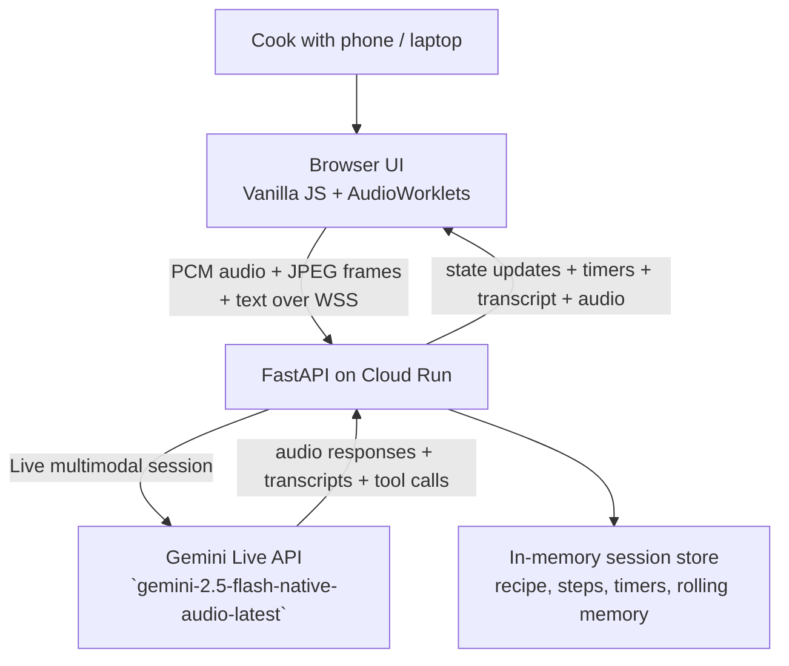

# SousChef Live

**A real-time AI sous-chef that sees, hears, and proactively guides you while you cook.**

Built for the [Gemini Live Agent Challenge](https://geminiliveagentchallenge.devpost.com/) using the Gemini Live API, Google Cloud Run, and the `google-genai` SDK.

---

## Judge Quick Links

- **Live demo (Europe):** [https://souschef-live-5z4a6smnda-ew.a.run.app](https://souschef-live-5z4a6smnda-ew.a.run.app)
- **Live app (judges / default deploy):** [https://souschef-live-5z4a6smnda-uc.a.run.app](https://souschef-live-5z4a6smnda-uc.a.run.app)
- **Demo script:** `docs/demo.md`
- **Presenter guide:** `docs/user-guide.md`
- **Deployment proof plan:** `docs/deployment-proof-plan.md`
- **Full technical design:** `docs/design.md`

---

## What It Does

SousChef Live streams your kitchen camera and microphone to a Gemini Live model that watches, listens, and coaches you in real-time — hands-free. Unlike recipe chatbots, SousChef:

- **Sees** your cooking through continuous video (1 FPS JPEG frames)
- **Hears** both your voice and cooking sounds (16kHz PCM audio)
- **Speaks** naturally with native audio output (24kHz) and a chef persona
- **Interrupts** when it spots danger or mistakes (proactive audio)
- **Sets timers** automatically without being asked
- **Tracks your progress** through a cooking step state machine
- **Handles barge-in** — interrupt the chef mid-sentence and get immediate answers

## Architecture



Expanded architecture, sequence diagrams, and deployment details live in `docs/design.md`.

| Component | Technology |
|-----------|-----------|
| Frontend | Vanilla JS, AudioWorklets, Vite |
| Backend | FastAPI, Python 3.13, google-genai SDK |
| AI Model | gemini-2.5-flash-native-audio-latest |
| Deployment | Google Cloud Run |
| Audio | Raw PCM16 binary WebSocket frames |
| Video | JPEG frames at 1 FPS via JSON |

## Prerequisites

- Python 3.10+
- Node.js 18+
- A [Gemini API key](https://aistudio.google.com/apikey)
- (For deployment) `gcloud` CLI authenticated with a project

## Local Development

```bash
# 1. Clone and install
git clone <repo-url> && cd SousChefLive
pip install -r requirements.txt
npm install

# 2. Configure environment
cp .env.example .env
# Edit .env and add your GEMINI_API_KEY

# 3. Start dev servers
./scripts/dev.sh
# Frontend: http://localhost:5173
# Backend: http://localhost:8080
```

## Environment Variables

| Variable | Default | Description |
|----------|---------|-------------|
| `GEMINI_API_KEY` | (required) | Your Gemini API key from AI Studio |
| `MODEL` | `gemini-2.5-flash-native-audio-latest` | Gemini model for Live API |
| `SESSION_IDLE_TTL` | `300` | Seconds of inactivity before session expires |
| `SESSION_MAX_AGE` | `3600` | Absolute max session duration in seconds |
| `DEV_MODE` | `true` | Development mode flag |
| `LIVE_BACKEND_MODE` | `real` | `real` or `fake` (for testing) |

## Deployment to Cloud Run

```bash
export PROJECT_ID=your-project-id
export GEMINI_API_KEY=your-api-key
./scripts/deploy.sh
```

This deploys to **us-central1** by default. To deploy to a different region (e.g. Europe for lower latency):

```bash
REGION=europe-west1 ./scripts/deploy.sh
```

The script will:
1. Build the frontend with Vite
2. Enable required GCP services
3. Deploy to Cloud Run with session affinity, min-instances=1, and all env vars configured

## Testing

```bash
# Backend unit tests (77 tests)
python -m pytest server/tests/unit/ -v

# Backend integration tests (15 tests)
LIVE_BACKEND_MODE=fake python -m pytest server/tests/integration/ -v

# Live API & deployed E2E tests (40 tests)
GEMINI_API_KEY=your-api-key python -m pytest tests/live/ -v

# Browser tests against deployed app (32 tests)
npx playwright test --config tests/browser/playwright.config.js

# Full harness
./scripts/harness/run-all.sh
```

## Tech Stack

- **google-genai SDK** — Direct Gemini Live API connection with native audio
- **FastAPI** — Async WebSocket server bridging browser and Gemini
- **AudioWorklets** — Low-latency 16kHz capture and 24kHz playback
- **Vite** — Frontend build tooling
- **Cloud Run** — Serverless deployment with WebSocket support

## Project Structure

```
server/
  main.py           # FastAPI app + WebSocket endpoint
  gemini_live.py    # GeminiLive bridge class with retry loop
  session_store.py  # In-memory session state + timers
  memory.py         # Session memory, conversation compaction, fact extraction
  tools.py          # update_recipe, set_timer, update_cooking_step, get_cooking_state
  prompts.py        # System instruction + tool declarations
  observability.py  # Structured logging + event emission

frontend/
  index.html        # Mobile-first UI shell
  src/main.js       # Entry point + WebSocket orchestration
  src/state.js      # Reactive state management
  src/ui.js         # DOM renderer (timers, transcript, chips, waveform)
  src/debug.js      # Frontend observability
  src/lib/gemini-live/
    geminilive.js   # WebSocket client with auto-reconnect
    mediaUtils.js   # AudioStreamer, VideoStreamer, AudioPlayer
  public/audio-processors/
    capture.worklet.js   # 16kHz mic capture
    playback.worklet.js  # 24kHz audio playback

harness/
  fakes/            # Deterministic Gemini Live adapter for testing
tests/
  live/             # Real API and deployed-service smoke tests
  browser/          # Playwright browser tests
scripts/
  dev.sh            # Local development
  deploy.sh         # Cloud Run deployment
  harness/          # Test harness scripts
```

## Data Sources

SousChef Live does not use any external datasets, databases, or pre-built recipe APIs. All cooking knowledge comes from the Gemini model's built-in capabilities. The only external service is the **Gemini Live API** via the `google-genai` SDK. Session state (recipe, step, timers, conversation memory) is stored in-memory on the Cloud Run instance for the duration of each cooking session.

## Findings and Learnings

Building a real-time multimodal agent for a live, physical-world task taught us several things that don't show up in tutorials:

**Gemini Live API is powerful but volatile.** The bidi streaming connection can drop mid-session with opaque errors (e.g. `1008: Operation not implemented`). We learned the hard way that a single-connection architecture is fragile — our final design includes an inner retry loop with session resumption handles and app-owned memory compaction so that upstream drops are invisible to the cook.

**Native audio changes the UX equation.** Text-to-speech feels robotic in a kitchen. Gemini's native audio generation (Aoede voice) produces natural speech that doesn't break immersion. The difference is dramatic — it turns the app from a "talking chatbot" into something that genuinely feels like a person standing beside you.

**Proactive behavior is the killer feature, but it's hard to test.** The system instruction tells the chef to interrupt when it sees danger. Whether it actually does depends on video quality, lighting, and LLM non-determinism. We built extensive automated testing (WebSocket E2E, Playwright browser tests, live API smoke tests) but ultimately, real food in a real kitchen is the only definitive test.

**Latency is everything for voice apps.** We moved from us-central1 to europe-west1 for the demo because ~300ms RTT felt sluggish in conversation. At ~15ms RTT the interaction becomes natural. For production, region selection should match user geography.

**Context window management matters for long sessions.** A 30-minute cooking session can exhaust the context window. We implemented a multi-layer memory system: Gemini's built-in context window compression (trigger at 108K tokens, slide to 80K), session resumption handles for transport recovery, and app-owned deterministic compaction that summarizes older turns using a cheap model (`gemini-2.0-flash-lite`). This keeps the chef coherent across the full cooking arc.

**Observability is non-negotiable for agent development.** We instrumented 40+ structured log points across the backend. Without full white-box visibility into tool calls, upstream disconnects, memory compaction triggers, and timer events, debugging non-deterministic agent behavior would be nearly impossible.

## Hackathon Context

- **Challenge**: [Gemini Live Agent Challenge](https://geminiliveagentchallenge.devpost.com/)
- **Category**: Live Agents
- **Deadline**: March 16, 2026
- **Key features demonstrated**: Proactive multimodal supervision, native audio, barge-in interruption, tool calling, session memory with context compaction, and Cloud Run deployment
