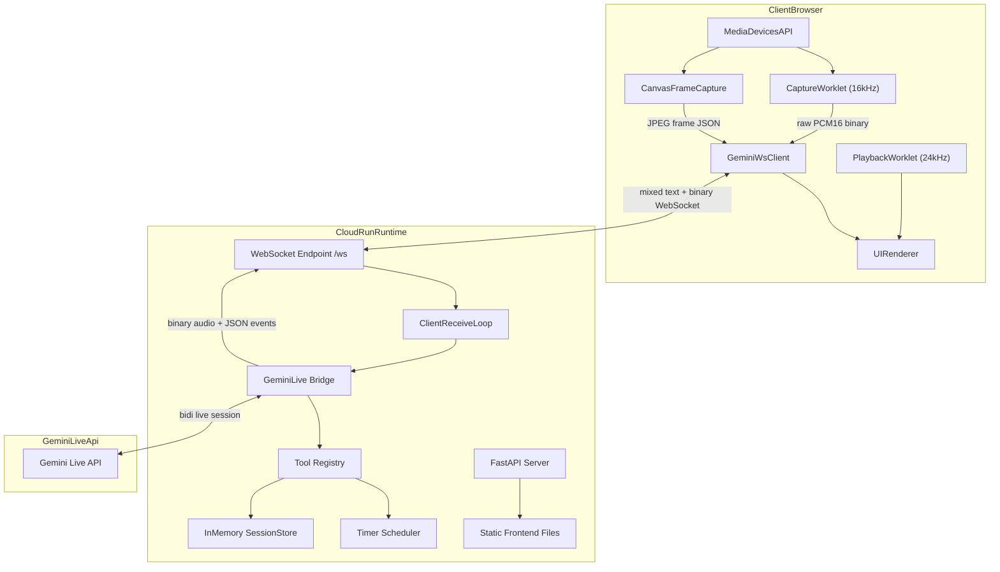
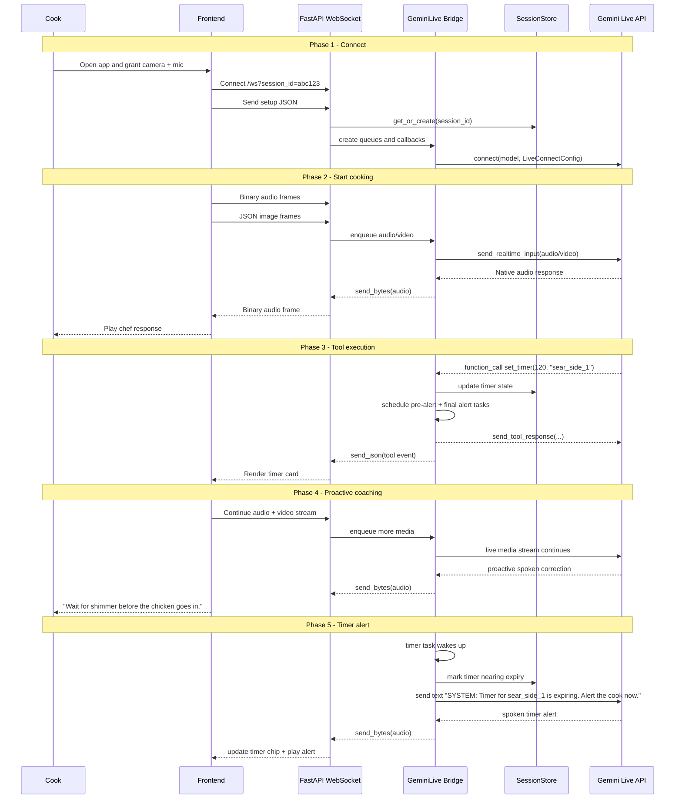
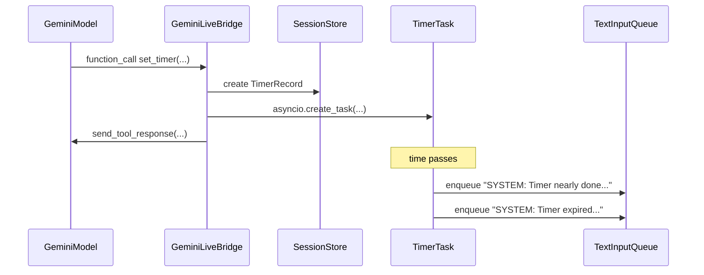
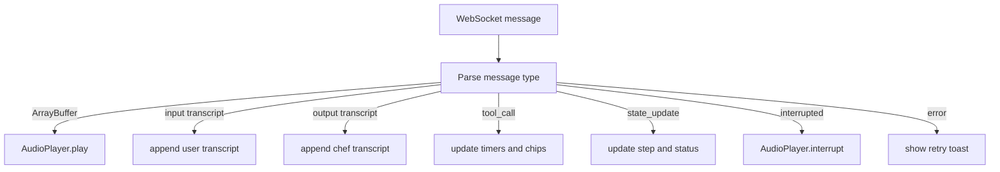
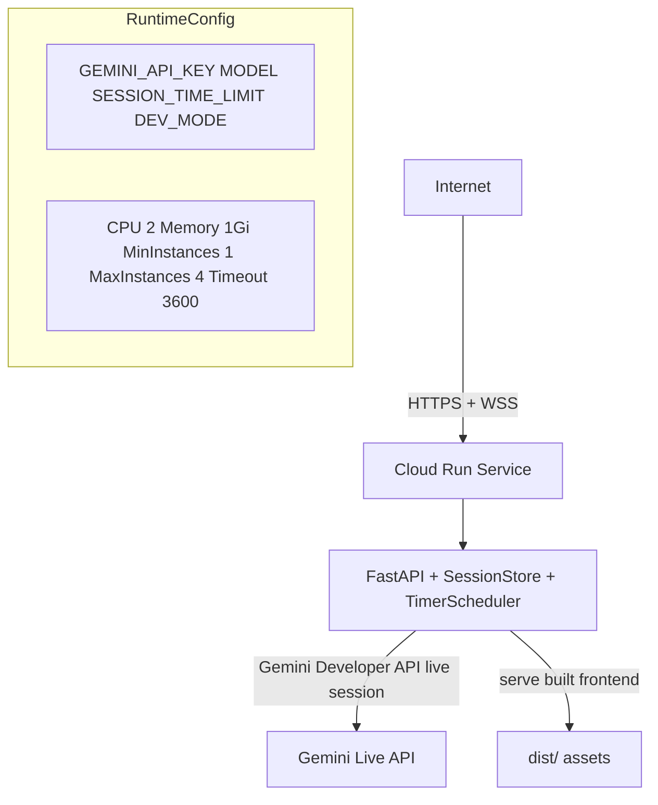
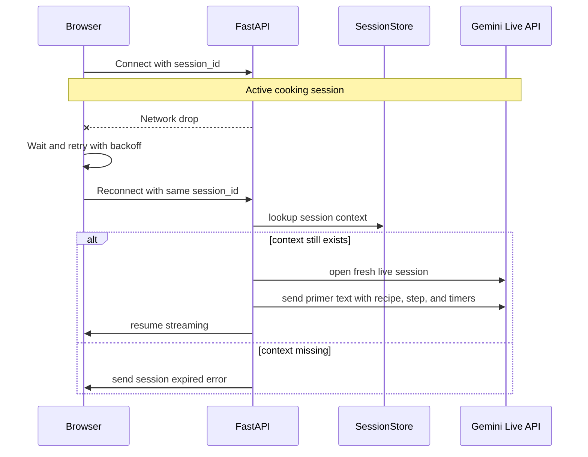
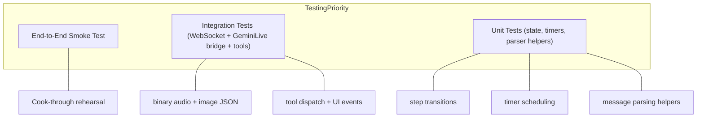

# SousChef Live -- Technical Design

> **Sources**: This design is informed by the official challenge materials, Google Cloud's current agent-pattern guidance, and the strongest reference implementation we found:
> [Gemini Live Agent Challenge resources](https://geminiliveagentchallenge.devpost.com/resources),
> [Choose a design pattern for your agentic AI system](https://docs.cloud.google.com/architecture/choose-design-pattern-agentic-ai-system),
> [Immersive Language Learning with Live API](https://github.com/ZackAkil/immersive-language-learning-with-live-api),
> [ADK Gemini Live API Toolkit overview](https://google.github.io/adk-docs/streaming/),
> [ADK Bidi-streaming Dev Guide Part 1](https://google.github.io/adk-docs/streaming/dev-guide/part1/),
> [Level 3 Codelab (Bidi-streaming Agent)](https://codelabs.developers.google.com/way-back-home-level-3),
> [Visual Guide (Medium)](https://medium.com/google-cloud/adk-bidi-streaming-a-visual-guide-to-real-time-multimodal-ai-agent-development-62dd08c81399)
>
> We are intentionally implementing SousChef Live with the raw `google-genai` SDK instead of ADK. The capabilities are the same Gemini Live features, but the runtime is simpler, lower-latency, and easier to debug for a hackathon build.
>
> This document targets the Gemini Developer API with `GEMINI_API_KEY` for the live model connection. Cloud Run is still the deployment platform, but Vertex AI is not the default auth path for v1.

## 1. System Architecture

### 1.1 High-Level Overview

SousChef Live has three runtime layers: a browser client, a FastAPI bridge running on Cloud Run, and the Gemini Live API.



### 1.2 Architecture Choice

We are not using ADK for this version, and we are not building a multi-agent system.

Why this is the right trade-off:
- The Immergo sample is a production-quality Google reference app using the raw `google-genai` SDK.
- Raw binary audio over WebSocket is simpler and lower-latency than base64-wrapped audio JSON.
- Manual tool execution is easier to reason about than debugging an extra orchestration layer.
- In-memory session state is fast enough for a single-demo-user hackathon product.
- This keeps the build focused on the product experience, not framework integration work.
- Google's current agentic design guidance recommends starting with a single-agent system for structured tool-using workloads like this one before adding orchestration layers.

Pattern fit:
- Gemini is the single multimodal agent.
- The app adds custom logic for timer scheduling, reconnect priming, session state, and UI event fan-out.
- This preserves low latency while keeping the reliability-critical workflow pieces deterministic.

Runtime choice:
- The backend authenticates with `GEMINI_API_KEY`, which is the path already verified for this project.
- Vertex AI can be revisited later, but it is not the build target for this version.

### 1.3 Component Responsibilities

**Browser client**
- Captures microphone audio at 16kHz mono PCM through an `AudioWorklet`.
- Captures video frames from the camera, compresses them to JPEG, and sends them as JSON messages.
- Sends the first `{setup: {...}}` message with voice preference, response modality, and transcription toggles. The server injects the system instruction and tool declarations.
- Receives binary audio frames from the backend and plays them through a playback worklet.
- Renders the live camera feed, timer cards, transcript panel, step chips, and session badge.

**FastAPI bridge**
- Accepts one WebSocket per cooking session.
- Creates `asyncio.Queue` objects for audio, video, and text inputs.
- Constructs a `google.genai.types.LiveConnectConfig` from the initial setup payload, including `ContextWindowCompressionConfig(sliding_window=SlidingWindow())` to extend audio+video sessions beyond the default 2-minute limit.
- Creates `genai.Client(api_key=os.environ["GEMINI_API_KEY"])`.
- Opens the Gemini Live session directly with `client.aio.live.connect(...)`.
- Manually dispatches model tool calls to Python functions and sends tool responses back to Gemini.
- Emits JSON UI events to the browser when timers, steps, or transcripts change.

**Session store**
- Holds per-session recipe context, current step, timers, monitoring status, and a short transcript window.
- Lives in memory inside the Cloud Run instance for hackathon speed.
- Is keyed by `session_id` and cleaned up after session end or inactivity TTL.
- Is intentionally local-first; Firestore can be added later if we need persistence across instance restarts.

**Gemini Live**
- Handles natural voice input/output, VAD, interruption, and multimodal reasoning.
- Receives raw audio blobs and JPEG image blobs in the live session.
- Calls our tools for timers and cooking state updates.
- Speaks in-character using native audio rather than a separate TTS stack.

### 1.4 Session Context Shape

The server will keep lightweight session state like this:

```python
session_store[session_id] = {
    "recipe_name": "garlic butter chicken thighs",
    "current_step": "heat",
    "monitoring_status": "Watching pan heat",
    "demo_speed": False,
    "timers": {},
    "transcript_window": deque(maxlen=12),
    "started_at": time.time(),
    "last_seen_at": time.time(),
}
```

This is enough to:
- keep the UI consistent,
- power `get_cooking_state()`,
- drive timer alerts,
- and re-prime the agent on reconnect without needing a database.

---

## 2. Data Flow

### 2.1 Session Lifecycle



### 2.2 WebSocket Protocol

This protocol intentionally mixes **text frames** and **binary frames**:
- audio uses raw binary,
- setup and control use JSON text,
- video uses JSON because the frame is still base64-encoded for portability.

The browser may store the session ID as `sessionId` in local UI state, but the backend contract uses the `session_id` query parameter on `/ws`.

**Client -> Server**

| Type | Format | Description |
|------|--------|-------------|
| Setup | JSON `{"setup": {...}}` | First message only. Client sends voice preference, response modality, and transcription toggles. Server injects system instruction and tool declarations. |
| Audio | Binary frame | Raw PCM16 audio at 16kHz mono from the microphone. |
| Video | JSON `{"type": "image", "data": "<base64>", "mimeType": "image/jpeg"}` | JPEG frame captured from canvas. |
| Text | JSON `{"type": "text", "text": "..."}` | Optional manual/fallback input for debugging. |
| Control | JSON `{"type": "control", "action": "demo_speed", "value": true}` | UI state changes such as demo speed toggle or graceful session end. |

**Server -> Client**

| Type | Format | Description |
|------|--------|-------------|
| Audio | Binary frame | Raw PCM16 audio from Gemini at 24kHz. |
| Input transcript | JSON `{"serverContent":{"inputTranscription":{"text":"...","finished":true}}}` | Cook speech transcription. |
| Output transcript | JSON `{"serverContent":{"outputTranscription":{"text":"...","finished":true}}}` | Chef speech transcription. |
| Tool event | JSON `{"type":"tool_call","name":"set_timer","args":{...},"result":{...}}` | Server-side tool execution event for UI updates. |
| State update | JSON `{"type":"state_update","current_step":"flip","monitoring_status":"Watching crust color","recipe_name":"garlic butter chicken thighs","timers":[...]}` | Consolidated session state for chips and cards. |
| Interrupt | JSON `{"serverContent":{"interrupted":true}}` | Client should stop current playback immediately. |
| Turn complete | JSON `{"serverContent":{"turnComplete":true}}` | Client can clear speaking state. |
| Error | JSON `{"type":"error","error":"..."}` | Show UI error and allow retry. |

### 2.3 Video Frame Pipeline

```mermaid
graph LR
  Camera["getUserMedia video stream"] --> VideoEl["HTMLVideoElement"]
  VideoEl --> Canvas["Canvas 640x480"]
  Canvas -->|"toBlob(image/jpeg, 0.8)"| BlobReader["FileReader"]
  BlobReader -->|"base64 string"| JsonFrame["image JSON message"]
  JsonFrame --> WsSend["WebSocket send(JSON)"]
  WsSend --> Server["FastAPI"]
  Server -->|"base64 decode"| RawBytes["raw JPEG bytes"]
  RawBytes -->|"audio/video queues"| Bridge["GeminiLive Bridge"]
  Bridge -->|"types.Blob(mime_type=image/jpeg)"| LiveApi["Gemini Live API"]
```



Default video settings:
- `1 FPS`
- `640x480`
- JPEG quality `0.8`

Rationale:
- These settings match the Immergo reference implementation.
- They keep bandwidth reasonable while still giving the model enough context for kitchen monitoring.
- If testing shows we need more visual responsiveness, we can raise capture to `2 FPS` without changing the overall architecture.

### 2.4 Audio Pipeline

```mermaid
graph LR
  Mic["getUserMedia audio stream"] --> AudioCtx["AudioContext 16kHz"]
  AudioCtx --> Capture["capture.worklet.js"]
  Capture -->|"4096 float samples"| Pcm16["convert Float32 to PCM16"]
  Pcm16 -->|"ArrayBuffer binary frame"| WsAudio["WebSocket send(bytes)"]
  WsAudio --> Server["FastAPI"]
  Server -->|"audio queue"| Bridge["GeminiLive Bridge"]
  Bridge -->|"types.Blob audio/pcm;rate=16000"| LiveApi["Gemini Live API"]
  LiveApi -->|"binary PCM16 24kHz"| WsReturn["WebSocket send_bytes"]
  WsReturn --> Player["AudioPlayer"]
  Player --> Playback["playback.worklet.js"]
  Playback --> Speaker["device speaker"]
```



Why this is a major improvement over the old design:
- no base64 overhead for audio,
- no JSON parsing on every audio chunk,
- no need to extract `inlineData.data` on the client,
- and lower end-to-end latency during barge-in.

---

## 3. Component Design

### 3.1 `GeminiLive` Bridge Class

The backend center of gravity is a small wrapper class based on the Immergo sample:

```python
import asyncio
import inspect
import google.genai as genai
from google.genai import types


class GeminiLive:
    def __init__(self, api_key: str, model: str):
        self.client = genai.Client(api_key=api_key)
        self.model = model
        self.tool_mapping = {}

    def register_tool(self, func):
        self.tool_mapping[func.__name__] = func
        return func

    async def start_session(
        self,
        audio_input_queue,
        video_input_queue,
        text_input_queue,
        audio_output_callback,
        event_callback,
        setup_config,
    ):
        config = build_live_config(setup_config)
        async with self.client.aio.live.connect(model=self.model, config=config) as session:
            ...
```

Core responsibilities:
- map the setup JSON into `types.LiveConnectConfig`,
- open the live session,
- stream audio/video/text into Gemini,
- receive transcripts, interruptions, tool calls, and audio,
- and route server-side tool responses back to Gemini.

Model choice:

```python
MODEL = os.getenv("MODEL", "gemini-2.5-flash-native-audio-latest")
```

Why this model:
- native audio input/output,
- multimodal video understanding,
- interruption handling,
- function calling,
- and this is the specific Live model path already validated for this project.

We are not targeting `gemini-3-flash-preview` for v1 because it does not currently support the Live API bidi session used by this architecture. It remains a future upgrade candidate once Google enables Live support for it.

### 3.2 Live Session Setup

The client sends a first-message setup payload. The backend turns that into the actual connect config.

Representative setup shape:

```json
{
  "setup": {
    "generation_config": {
      "response_modalities": ["AUDIO"],
      "speech_config": {
        "voice_config": {
          "prebuilt_voice_config": {
            "voice_name": "Aoede"
          }
        }
      }
    },
    "input_audio_transcription": {},
    "output_audio_transcription": {}
  }
}
```

> **Note:** `system_instruction` and `tools` are not sent by the client. They are injected server-side in `main.py` and always override any client-provided values. `proactivity` config (e.g. `proactiveAudio`) is not supported in the Live API wire protocol — proactive behavior is driven by the system instruction instead. `enable_affective_dialog` is also rejected by the API and is omitted.

Server-side mapping (from client setup payload):
- `response_modalities` -> `types.Modality.AUDIO`
- `speech_config` -> `types.SpeechConfig(...)`
- transcription toggles -> `types.AudioTranscriptionConfig()`

Server-side injected (not from client):
- `system_instruction` -> built in `main.py` from the prompt template
- `tools` -> built by `build_tool_declarations()` in `main.py`
- Proactive behavior is driven by the system instruction, not a wire-protocol config field

### 3.3 Session Store and Timer Scheduler

Instead of Firestore, we will use a local in-memory store plus background timer tasks.

Suggested server objects:

```python
@dataclass
class TimerRecord:
    id: str
    label: str
    total_seconds: int
    effective_seconds: int
    started_at: float
    task: asyncio.Task | None = None


@dataclass
class SessionContext:
    session_id: str
    recipe_name: str | None = None
    current_step: str = "idle"
    monitoring_status: str = "Waiting for ingredients"
    demo_speed: bool = False
    timers: dict[str, TimerRecord] = field(default_factory=dict)
    transcript_window: deque[str] = field(default_factory=lambda: deque(maxlen=12))
    last_seen_at: float = field(default_factory=time.time)
```

Why in-memory is acceptable for v1:
- one demo user,
- fastest path to working software,
- timer callbacks stay close to the live session,
- no database schema or auth work,
- and Cloud Run session affinity improves the odds of reconnecting to the same instance during a demo.

Trade-off:
- if the container restarts, session state is lost,
- but that is acceptable for hackathon scope and clearly documented. Reconnect logic must still be designed as best-effort state restore rather than relying on affinity.

### 3.4 System Instruction Design

The instruction is still the most important product artifact. It must make the agent feel like a live sous-chef rather than a chat bot.

Recommended structure:

```text
IDENTITY
- calm, confident chef mentor
- concise and observant
- never breaks character

KITCHEN AWARENESS
- watch the video continuously
- listen to both speech and cooking sounds
- speak up when safety or timing matters

INTERVENTION RULES
- if there is danger or an obvious mistake, interrupt immediately
- otherwise wait until the cook finishes speaking
- when uncertain, describe observations instead of claiming precision

TOOL RULES
- update_recipe() as soon as the cook agrees on a dish
- set_timer() whenever a timed step starts
- update_cooking_step() when the cook moves to a new phase
- get_cooking_state() when you need to re-orient

VOICE STYLE
- max 2 sentences
- one instruction at a time
- practical kitchen language
```

Critical behavioral rules:
- "You are always monitoring the stove, pan, knife work, and browning."
- "If you see smoke, burnt garlic, weak heat, or unsafe technique, speak immediately."
- "Do not ask whether the cook wants a timer. Start it."
- "If the cook interrupts you, stop and answer the interruption first."
- "Never say 'as an AI' or explain your system."

### 3.5 Tool Design and Manual Execution

Tool calls come back from Gemini in `response.tool_call.function_calls`.
The bridge executes them manually, sends a tool response back to Gemini, and also emits a UI event to the client.

#### `update_recipe`

```python
async def update_recipe(recipe_name: str) -> dict:
    ...
```

Implementation:
- set or update `recipe_name` on the `SessionContext`,
- emit a `state_update` event to the browser,
- return the new snapshot so Gemini knows the recipe is locked in.

This is called as soon as the cook agrees on a dish, before any cooking steps begin.

#### `set_timer`

```python
async def set_timer(duration_seconds: int, label: str) -> dict:
    ...
```

Implementation:
- validate the duration and label,
- divide by `10` if `demo_speed=True`,
- create a `TimerRecord` in `SessionContext`,
- schedule a background task for pre-alert and final alert,
- send a `tool_call` JSON event to the client so a timer card appears,
- return the effective duration and timer ID to Gemini.

Timer alert flow:



The timer task does not speak directly.
It injects system text back into the live session so the chef remains the one voice the user hears.

#### `update_cooking_step`

```python
async def update_cooking_step(step_name: str) -> dict:
    ...
```

Implementation:
- validate against the allowed step list,
- update `current_step` and `monitoring_status`,
- emit a `state_update` event to the browser,
- return the new snapshot so Gemini knows the change succeeded.

#### `get_cooking_state`

```python
async def get_cooking_state() -> dict:
    ...
```

Returns:
- current step,
- recipe name,
- monitoring status,
- and active timers with remaining seconds.

This is the tool Gemini can use after interruptions, long pauses, or reconnect re-priming.

### 3.6 Downstream Event Parsing

The client parser becomes much simpler because audio is no longer embedded in JSON.

```javascript
socket.onmessage = (event) => {
  if (event.data instanceof ArrayBuffer) {
    audioPlayer.play(event.data);
    return;
  }

  const msg = JSON.parse(event.data);

  if (msg.serverContent?.interrupted) {
    audioPlayer.interrupt();
  }

  if (msg.serverContent?.inputTranscription) {
    transcript.addInput(msg.serverContent.inputTranscription.text);
  }

  if (msg.serverContent?.outputTranscription) {
    transcript.addOutput(msg.serverContent.outputTranscription.text);
  }

  if (msg.type === "tool_call" || msg.type === "state_update") {
    updateUiFromToolEvent(msg);
  }
};
```

This is cleaner than the ADK/codelab pattern because:
- the browser never decodes base64 audio,
- there is no nested `inlineData.data` parsing path for normal playback,
- and interruption handling becomes a simple `audioPlayer.interrupt()`.

### 3.7 FastAPI Server Structure

```python
app = FastAPI()
session_store = {}


@app.websocket("/ws")
async def websocket_endpoint(websocket: WebSocket, session_id: str):
    await websocket.accept()

    setup_message = json.loads(await websocket.receive_text())
    setup_config = setup_message["setup"]
    session = get_or_create_session(session_store, session_id)

    audio_input_queue = asyncio.Queue()
    video_input_queue = asyncio.Queue()
    text_input_queue = asyncio.Queue()

    gemini = GeminiLive(
        api_key=os.environ["GEMINI_API_KEY"],
        model=MODEL,
    )
    register_session_tools(gemini, session, text_input_queue, websocket)

    async def receive_from_client():
        while True:
            message = await websocket.receive()
            if message.get("bytes"):
                await audio_input_queue.put(message["bytes"])
                continue

            if not message.get("text"):
                continue

            payload = json.loads(message["text"])
            if payload.get("type") == "image":
                await video_input_queue.put(base64.b64decode(payload["data"]))
            elif payload.get("type") == "text":
                await text_input_queue.put(payload["text"])
            elif payload.get("type") == "control":
                apply_control_message(session, payload)

    async def send_audio(data: bytes):
        await websocket.send_bytes(data)

    async def send_event(event: dict):
        await websocket.send_json(event)

    client_task = asyncio.create_task(receive_from_client())
    try:
        await asyncio.wait_for(
            run_session(
                gemini,
                audio_input_queue,
                video_input_queue,
                text_input_queue,
                send_audio,
                send_event,
                setup_config,
            ),
            timeout=SESSION_TIME_LIMIT,
        )
    finally:
        client_task.cancel()
        cancel_session_timers(session)
        await cleanup_session_if_idle(session_store, session_id)
```

Key implementation details:
- the first text frame must be the setup payload,
- `receive_from_client()` must run in its own task while the Gemini session is active,
- binary frames are treated as audio only,
- image frames stay JSON for clarity,
- session cleanup cancels pending timer tasks,
- and a short inactivity TTL clears orphaned session contexts.

### 3.8 Frontend Architecture

We will still use plain JavaScript modules and browser APIs, but the structure will mirror the proven Immergo layout.

```text
frontend/
  index.html
  src/main.js
  src/lib/gemini-live/geminilive.js
  src/lib/gemini-live/mediaUtils.js
  src/state.js
  src/ui.js
  public/audio-processors/capture.worklet.js
  public/audio-processors/playback.worklet.js
```

Suggested state model:

```javascript
const state = {
  sessionId: "",
  ws: null,
  isConnected: false,
  isAgentSpeaking: false,
  currentStep: "idle",
  monitoringStatus: "Waiting for ingredients",
  timers: [],
  transcript: [],
  demoSpeed: false,
  sessionInfo: { region: "us-central1", rttMs: 0 },
};
```

UI update flow:



### 3.9 Architecture Decisions from Resource Review

#### Raw SDK over ADK

We are choosing the raw `google-genai` SDK because the reference app we studied proves it is a viable production path for Gemini Live. For this project, that is more valuable than ADK abstractions.

#### Binary audio over WebSocket

This is the most important transport change in the redesign.

Benefits:
- less bandwidth,
- less serialization work,
- lower latency,
- and fewer moving parts during interruption.

#### Video defaults: `1 FPS`, `640x480`, `0.8` quality

We are following the Immergo baseline instead of the ADK codelab baseline.

Why:
- it is already used in a live multimodal product sample,
- it keeps bandwidth stable,
- and it is likely sufficient for pan state, browning, and knife work.

If proactive vision feels too slow in practice, the first knob to turn is `2 FPS`.

#### In-memory state first

Firestore is explicitly deferred.

For a hackathon build, in-memory state gives us:
- instant reads and writes,
- less infrastructure,
- and simpler timer scheduling.

The cost is reduced resilience across instance restarts, which is acceptable for v1.

#### Instruction-driven proactivity, not unsupported config

We are not adding a separate monitoring tool loop.
The agent is taught to speak up through the system instruction and ongoing multimodal context, not through an unsupported Live API `proactivity` config field.

This keeps:
- cost lower,
- latency lower,
- and the mental model simpler.

#### No forced opening "Hello" turn

The old ADK plan inherited the codelab idea of injecting a startup `"Hello"` message.
We will not do that by default.

Why:
- the cook should naturally start by showing ingredients or asking for help,
- it makes the experience feel less like a chat bot waiting for prompts,
- and it avoids spending an early turn on synthetic setup chatter.

If we need a safer demo flow, the UI can send a deliberate first prompt such as `"I'm ready to cook."`

---

## 4. Deployment Architecture

### 4.1 Cloud Run Topology



Critical settings:
- **Session affinity**: enabled as a best-effort reconnect optimization, not as a persistence guarantee.
- **Timeout**: `3600s`, so a cooking session is not terminated early by the platform.
- **Min instances**: `1`, to avoid cold starts during the demo.
- **Concurrency**: `1`, prioritizing demo reliability and stable audio/video performance over throughput.
- **Unauthenticated access**: acceptable for the hackathon deployment.
- **API key injection**: `GEMINI_API_KEY` is provided as a Cloud Run env var for v1. We can move it to Secret Manager later without changing the app architecture.

### 4.2 Dockerfile

We will keep a simple Python runtime image that serves the already-built frontend from `dist/`.

```dockerfile
FROM python:3.13-slim

WORKDIR /app

COPY requirements.txt .
RUN pip install --no-cache-dir -r requirements.txt

COPY server ./server
COPY dist ./dist

EXPOSE 8080
CMD ["python", "-m", "uvicorn", "server.main:app", "--host", "0.0.0.0", "--port", "8080"]
```

This Dockerfile stays small because the deployment script builds the frontend first.

### 4.3 `deploy.sh`

Primary deployment path:
- build the frontend locally,
- then let Cloud Run deploy the Python service from source.

```bash
#!/bin/bash
set -euo pipefail

cd "$(dirname "$0")/.."

PROJECT_ID="${PROJECT_ID:?Set PROJECT_ID}"
GEMINI_API_KEY="${GEMINI_API_KEY:?Set GEMINI_API_KEY}"
SERVICE_NAME="souschef-live"
REGION="${REGION:-us-central1}"
MODEL="gemini-2.5-flash-native-audio-latest"

echo "Building frontend..."
npm run build

echo "Enabling required services..."
gcloud services enable \
  run.googleapis.com \
  cloudbuild.googleapis.com \
  artifactregistry.googleapis.com \
  --project "$PROJECT_ID"

echo "Deploying Cloud Run service..."
gcloud run deploy "$SERVICE_NAME" \
  --source . \
  --project "$PROJECT_ID" \
  --region "$REGION" \
  --allow-unauthenticated \
  --session-affinity \
  --timeout 3600 \
  --min-instances 1 \
  --max-instances 4 \
  --concurrency 1 \
  --cpu 2 \
  --memory 1Gi \
  --set-env-vars GEMINI_API_KEY="$GEMINI_API_KEY" \
  --set-env-vars MODEL="$MODEL" \
  --set-env-vars SESSION_TIME_LIMIT="900" \
  --set-env-vars DEV_MODE="false"
```

This follows the same operational model as the Immergo sample, but with our smaller env surface area.

### 4.4 `app.json` and Runtime Dependencies

We should include `app.json` for a Cloud Run deploy button.

Minimal shape:

```json
{
  "name": "SousChef Live",
  "description": "A real-time AI sous-chef using Gemini Live API on Cloud Run.",
  "hooks": {
    "prebuild": {
      "commands": [
        "gcloud services enable run.googleapis.com cloudbuild.googleapis.com artifactregistry.googleapis.com --project $GOOGLE_CLOUD_PROJECT"
      ]
    }
  }
}
```

Minimal `requirements.txt`:

```text
fastapi==0.116.1
uvicorn[standard]==0.35.0
google-genai==1.67.0
python-dotenv==1.0.0
websockets==15.0.1
```

These are intentionally close to the production sample we studied.

---

## 5. Error Handling Strategy

### 5.1 Error Categories and Responses

| Error | Detection | Recovery | User Impact |
|-------|-----------|----------|-------------|
| Client WebSocket disconnect | `WebSocketDisconnect` or closed socket | Cancel stream tasks, keep `SessionContext` warm for a short TTL | Brief interruption; user can reconnect |
| Network reconnect | Client `onclose` / heartbeat miss | Reconnect with same `session_id`, rebuild Gemini session, re-prime from local state | Short gap, then coaching resumes |
| Gemini connection failure | Exception from `client.aio.live.connect()` or receive loop | Send error event, allow user retry, keep timer state if possible | Agent goes silent until retry |
| Tool execution failure | Exception inside tool function | Return structured error result to Gemini and emit UI warning event | Agent can apologize and continue |
| Timer task failure | Cancelled task or task exception | Remove broken timer and show fallback UI warning | Timer alert may be missed |
| Instance restart | Missing session context on reconnect | Start a fresh session and ask cook to restate ingredients/current step | Worst-case reset during demo |
| Camera permission denied | `getUserMedia` rejection | Offer audio-only fallback | No visual supervision |
| Audio playback failure | Audio context/worklet exception | Retry init, fall back to transcript-only mode | User reads instead of hearing |
| Cold start latency | First request delayed | Min instances = 1 | Avoided in demo path |

### 5.2 Reconnection Flow

This is now **application-level state restore**, not ADK session resumption.



The reconnect primer can look like:

```text
SYSTEM: Resume kitchen coaching. Current recipe: garlic butter chicken thighs.
Current step: sear_side_1.
Active timers: sear_side_1 has 28 seconds remaining.
```

### 5.3 Graceful Degradation

The system should degrade in this order:

```text
camera + mic + live chef
audio-only chef
local timer UI + transcript fallback
retry screen
```

---

## 6. Testing Strategy

### 6.1 Testing Pyramid

Given the 3-day hackathon timeline, testing is still weighted toward demo reliability, but the integration layer is now the raw SDK bridge rather than ADK.



### 6.2 Unit Tests

**State machine**
- valid step transitions,
- duplicate step updates,
- invalid skips,
- and monitoring status updates.

**Timer logic**
- demo-speed duration compression,
- pre-alert and final alert scheduling,
- remaining-time calculation,
- and cancellation cleanup.

**Client message parsing**
- binary audio playback path,
- transcription event parsing,
- interrupt handling,
- malformed JSON safety.

### 6.3 Integration Tests

**WebSocket round-trip**
- connect and send the setup payload,
- send one binary audio frame,
- send one image JSON frame,
- verify the bridge queues receive both correctly,
- disconnect and ensure timer tasks/session tasks are cleaned up.

**Tool execution**
- `update_recipe()` sets the recipe name and emits a state update,
- `set_timer()` updates session state and emits UI events,
- `update_cooking_step()` updates the step chip,
- `get_cooking_state()` returns the right remaining timer values.

**Reconnect path**
- reconnect with the same `session_id`,
- verify the reconnect primer is built from session state,
- verify the UI receives the restored timer/state snapshot.

### 6.4 End-to-End Smoke Test

The most important test is still one real cook-through before recording the demo.

Checklist:
- [ ] Open app on phone and grant camera + mic permissions
- [ ] Show ingredients and say "Chef, I have chicken thighs, garlic, and butter"
- [ ] Agent suggests a dish in under 2 seconds after speech end
- [ ] Agent notices when the pan is not ready yet
- [ ] Agent sets a timer without being asked
- [ ] Timer card appears in the UI immediately
- [ ] Interrupt the chef mid-sentence and confirm playback stops cleanly
- [ ] Timer pre-alert fires before expiry
- [ ] Timer final alert fires at expiry
- [ ] Say "I don't have thyme" and confirm substitution help
- [ ] Let the session run 6+ minutes without drift or disconnect
- [ ] Transcript and step chips stay correct throughout

### 6.5 Demo Failure Modes and Mitigations

| Failure | Probability | Mitigation |
|---------|-------------|------------|
| Agent is not proactive enough | Medium | Make the instruction more explicit; fallback prompt: "What do you see right now?" |
| Audio latency creeps up | Medium | Keep min instances at 1 and use binary audio transport |
| Audio feedback loop | High | Use headphones or increase physical mic/speaker separation |
| Camera feed is unclear | Low | Test lighting and camera angle before demo |
| Reconnect loses state | Low | Use a stable network; session affinity helps, but reconnect must still restore state from memory when available |
| Tool result never reaches UI | Low | Log all tool events and mirror them into explicit `state_update` payloads |

---

## 7. Security Considerations

Minimal for hackathon scope, but still documented:

- **No persisted user media**: audio and video are streamed live and not stored.
- **Ephemeral session state**: cooking state lives in memory and is removed on cleanup/TTL expiry.
- **Environment variables only**: `GEMINI_API_KEY` and model configuration stay server-side.
- **HTTPS and WSS**: provided by Cloud Run automatically.
- **Unauthenticated demo endpoint**: acceptable for the hackathon, but not a production posture.
- **Origin checks and rate limiting**: can be added later if the public demo gets traffic.

---

## 8. Performance Budget

| Metric | Target | Measurement |
|--------|--------|-------------|
| Voice response latency | < 2s | Time from VAD end-of-speech to first binary audio chunk received |
| Video frame size | ~30-60KB | JPEG `640x480` at quality `0.8`, then base64-wrapped in JSON |
| Video frame rate | `1 FPS` default | Client-side capture interval |
| Audio chunk size | ~8KB | `4096` samples * `2` bytes PCM16 |
| Audio bandwidth | ~32KB/s | Raw PCM16 `16kHz * 2 bytes` with no base64 overhead |
| JSON event overhead | < 5KB/s | Transcript, tool, and state update messages |
| Total upstream bandwidth | ~65-95KB/s | ~32KB/s audio + ~30-60KB/s video + small JSON overhead |
| Cloud Run cold start | < 3s | Mitigated by `min-instances=1` |
| Session state lookup | < 1ms | In-memory dictionary access |
| Client bundle | < 100KB gzipped | Vanilla JS modules plus two worklets |

Binary audio is the main efficiency win in this redesign. Compared with base64-wrapped audio, it removes roughly one third of the audio transport overhead while also reducing encode/decode work on both ends.
